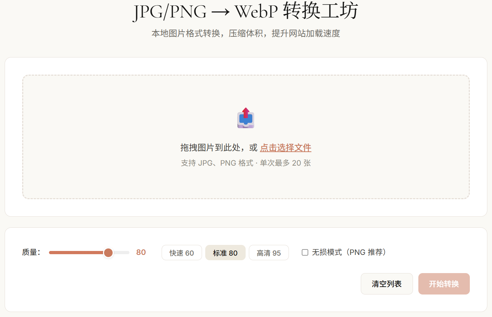

<p align="center">
  
</p>

<h1 align="center">jpg2webp</h1>

<p align="center">
  <strong>Local JPG/PNG → WebP Image Converter</strong><br>
  Drag, drop, convert — shrink images and speed up your blog<br>
  Fully local, no data upload, no internet required
</p>

<p align="center">
  <a href="README.md"><b>中文</b></a> &nbsp;|&nbsp;
  <a href="README_EN.md">English</a>
</p>

<p align="center">
  
  
  
</p>

---

## Quick Start

```bash
git clone https://github.com/Absurd-S/png2webp.git
cd jpg2webp
npm install        # Install dependencies (includes Sharp native binaries)
npm start          # Start server at http://localhost:3000
```

Open `http://localhost:3000` in your browser, drop images, and start converting.

Custom port:

```bash
PORT=8080 npm start
```

## Features

- **Drag & Drop** — Drag files or click to browse. Client-side `MIME` filtering for JPG/PNG, up to 20 files at once
- **Adjustable Quality** — `10–100` slider with Quick (60), Standard (80), High (95) presets
- **Lossless Mode** — `Sharp` `lossless` encoding for PNG with transparency; slider auto-disabled when active
- **Batch Conversion** — Server-side `Sharp` per-file conversion, `Archiver` streaming ZIP — never holds full archive in memory
- **Preview Comparison** — Click thumbnail for side-by-side original vs. WebP modal view
- **Compression Stats** — Auto-calculates original size, converted size, and savings percentage; one-click copy
- **Keyboard Shortcut** — `Ctrl + Enter` to start conversion, no mouse needed

## Screenshots



## API

### Endpoints

| Method | Path | Description |
|--------|------|-------------|
| `GET` | `/api/health` | Health check — status and uptime |
| `POST` | `/api/convert/single` | Single conversion, returns `image/webp` |
| `POST` | `/api/convert/batch` | Batch conversion, returns `application/zip` stream |

### Examples

```bash
curl -X POST http://localhost:3000/api/convert/single \
  -F "image=@photo.jpg" \
  -F "quality=80" \
  -o output.webp
```

Batch:

```bash
curl -X POST http://localhost:3000/api/convert/batch \
  -F "images=@photo1.jpg" \
  -F "images=@photo2.png" \
  -F "quality=80" \
  -o converted.zip
```

Response (`/api/health`):

```json
{
  "status": "ok",
  "uptime": 12.345
}
```

### Parameters

| Parameter | Type | Default | Description |
|-----------|------|---------|-------------|
| `image` / `images` | File / File[] | Required | JPG or PNG files, batch max 20 |
| `quality` | `int` | 80 | Quality 1–100, ignored in lossless mode |
| `lossless` | `bool` | false | Lossless WebP encoding (recommended for PNG) |

## Architecture

```
Browser (drag / settings)
        │
        ▼  multipart/form-data
   Express Server
        │
        ├── Multer ──▶ uploads/ (disk buffer)
        │
        ▼
   Sharp (libvips)
        │
        ├── Single ──▶ res.sendFile(.webp)
        │
        └── Batch ──▶ Archiver (streaming ZIP) ──▶ res (application/zip)

Cleanup ◀── res.on('close') ── delete uploads/ & outputs/
```

## Project Structure

```
jpg2webp/
├── server.js                 # Entry — boots Express, binds port
├── src/
│   ├── app.js                # Express config — static files, routes, error handler
│   ├── routes/
│   │   └── convert.js        # API routes — health / single / batch
│   ├── services/
│   │   └── converter.js      # Sharp core — convertOne() / convertBatch()
│   └── middleware/
│       └── upload.js         # Multer config — disk storage, MIME filter, size limits
├── public/
│   ├── index.html            # Frontend — drop zone, settings, file list, stats
│   ├── css/
│   │   └── style.css         # Styles — responsive layout, status badges, modal
│   └── js/
│       └── app.js            # Frontend logic — state machine, JSZip extraction, downloads
├── uploads/                  # Temp uploads (gitignored)
├── outputs/                  # Temp outputs (gitignored)
└── package.json
```

## Keyboard Shortcuts

| Shortcut | Action |
|----------|--------|
| `Ctrl + Enter` | Start conversion |
| Click thumbnail | Open original vs. WebP comparison |

## Dependencies

| Package | Purpose |
|---------|---------|
| [`express`](https://github.com/expressjs/express) | HTTP server framework |
| [`sharp`](https://github.com/lovell/sharp) | Image processing — JPG/PNG decode + WebP encode |
| [`multer`](https://github.com/expressjs/multer) | Multipart file upload parsing |
| [`archiver`](https://github.com/archiverjs/node-archiver) | Streaming ZIP archive |
| [`jszip`](https://github.com/Stuk/jszip) | Browser-side ZIP extraction (CDN) |

## Design Notes

- Color theme `#d4785c` (warm coral) on `#fdf6f0` (warm cream) background
- Sharp ignores `quality` in lossless mode — frontend auto-disables the slider
- Chinese filenames in `Content-Disposition` header use `encodeURIComponent`
- Archiver v8 uses `new ZipArchive(options)` instead of legacy `archiver(format, options)`
- All temp files are cleaned up on response close

## License

MIT © Absurd-S

---

<p align="center">
  <sub>Built with Node.js + Express + Sharp. Design inspired by Anthropic.</sub>
</p>
